# Pokiguard Feature Enhancement Plan

## Overview

This plan transforms the existing Pokiwar Unity project into a full-featured Pokiguard-style game, matching the UI and gameplay features of both Pokiguard (the remake) and the original Pokiwar game.

---

## Architecture Overview

```mermaid
graph TD
    GM[GameManager] --> GS[GameState]
    GM --> GMM[GameModeManager]
    GM --> MC[MapController]

    NM[NetworkManager] --> PN[PlayerNetwork]
    NM --> LS[LobbySystem]
    NM --> CS[ChatSystem]

    PC[PlayerController] --> SBC[SpeedBoostController]
    PC --> AS[AbilitySystem]

    EM[EvolutionManager] --> SD[SpriteDatabase]
    EM --> EEC[EvolutionEffectController]

    HC[HealthController] --> CM[CombatManager]
    PS[PlayerSync] --> CM

    HUD[HUDManager] --> LB[LeaderboardUI]
    HUD --> LVL[LevelBarUI]
    HUD --> MM[MinimapUI]
    HUD --> KF[KillFeedUI]
    HUD --> DS[DeathScreenUI]
    HUD --> EN[EvolutionNotificationUI]
    HUD --> MOB[MobileControls]

    AM[AudioManager] --> SFX[SoundEffects]
```



---

## Phase 1: Core Game Systems Enhancement

### 1.1 GameManager Enhancement
**File:** `Assets/Scripts/Core/GameManager.cs`

New features:
- Room/session management (room code generation)
- Game mode support (FFA, Survival)
- Map zone definitions
- Player registry (track all active players)
- Session timer
- Winner detection

### 1.2 PlayerData Enhancement
**File:** `Assets/Scripts/Core/PlayerData.cs`

New fields:
- `playerName` (user-entered name)
- `killCount` (players defeated this session)
- `totalXPEarned` (cumulative XP)
- `deathCount` (times died)
- `bestLevel` (highest level reached)
- `sessionStartTime`
- `foodCollectedThisSession`

### 1.3 GameState Enhancement
**File:** `Assets/Scripts/Core/GameState.cs`

New fields:
- `GameMode` enum (FFA, Survival, Practice)
- `RoomCode` string
- `SessionId`
- `TopPlayer` reference
- `GamePhase` (Lobby, Playing, GameOver)

### 1.4 SpeedBoostController (NEW)
**File:** `Assets/Scripts/Core/SpeedBoostController.cs`

Features:
- Stamina bar (drains while boosting)
- Cooldown after stamina depleted
- Visual feedback (trail effect)
- Speed multiplier configurable per level
- Network-synced boost state

---

## Phase 2: Evolution System Overhaul

### 2.1 EvolutionManager Enhancement
**File:** `Assets/Scripts/Evolution/EvolutionManager.cs`

New features:
- Multi-stage evolution chains (Baby → Basic → Stage1 → Stage2 → Mega)
- Evolution thresholds: levels 5, 15, 30, 50, 100
- Evolution animation trigger
- Size scaling per evolution stage
- Speed adjustment per stage
- Evolution chain display

### 2.2 SpriteDatabase Enhancement
**File:** `Assets/Scripts/Evolution/SpriteDatabase.cs`

New features:
- Evolution tier categories (5 tiers)
- Rarity system (Common, Uncommon, Rare, Epic, Legendary)
- Random sprite assignment on spawn
- Sprite preview in editor
- 4000+ sprite support with efficient lookup

### 2.3 EvolutionEffectController (NEW)
**File:** `Assets/Scripts/Evolution/EvolutionEffectController.cs`

Features:
- Flash/glow animation on level up
- Particle burst on evolution stage change
- Size tween animation
- Screen shake on mega evolution
- Sound trigger integration

### 2.4 FoodItem Enhancement
**File:** `Assets/Scripts/Evolution/FoodItem.cs`

Food types:
- **Normal** (white dot) - 1 XP
- **Rare** (yellow star) - 5 XP
- **Mega** (rainbow) - 25 XP
- **Poison** (purple) - -5 XP (danger food)
- **Speed** (blue) - temporary speed boost
- Visual size difference per type

### 2.5 FoodSpawner Enhancement
**File:** `Assets/Scripts/Evolution/FoodSpawner.cs`

New features:
- Weighted random spawning (70% normal, 20% rare, 8% mega, 2% poison)
- Food clusters (groups of food in areas)
- Rare food events (timed mega food spawns)
- Food density zones
- Network-synced food spawning (server-authoritative)

---

## Phase 3: Combat System Overhaul

### 3.1 CombatManager Enhancement
**File:** `Assets/Scripts/Combat/CombatManager.cs`

New features:
- Attack radius visualization
- Combat log (last 10 events)
- Damage type system (normal, critical, poison)
- Kill streak tracking
- XP reward scaling by level difference
- Floating damage numbers with animations

### 3.2 HealthController Enhancement
**File:** `Assets/Scripts/Combat/HealthController.cs`

New features:
- Shield mechanic (absorbs first hit after respawn - 3 seconds)
- Invincibility frames (0.5s after taking damage)
- Death animation trigger
- Health bar above player head
- Poison damage over time
- Max health scales with level

### 3.3 PlayerSync Enhancement
**File:** `Assets/Scripts/Multiplayer/PlayerSync.cs`

New features:
- Server-authoritative damage validation
- Anti-cheat: validate level difference before allowing damage
- Collision cooldown per-pair (not global)
- Knockback on hit
- Combat event broadcasting

### 3.4 AbilitySystem (NEW)
**File:** `Assets/Scripts/Combat/AbilitySystem.cs`

Features:
- Ability unlocked at evolution stage 2+
- Dash ability (quick movement burst)
- Area attack (damages nearby players)
- Shield ability (temporary invincibility)
- Cooldown system per ability
- Network-synced ability activation

---

## Phase 4: Multiplayer Enhancement

### 4.1 NetworkManager Enhancement
**File:** `Assets/Scripts/Multiplayer/NetworkManager.cs`

New features:
- Lobby system (waiting room before game starts)
- Room code generation and display
- Player name synchronization
- Max player enforcement
- Reconnection handling
- Server browser (list of active rooms)

### 4.2 PlayerNetwork Enhancement
**File:** `Assets/Scripts/Multiplayer/PlayerNetwork.cs`

New synced variables:
- `netPlayerName` - display name
- `netHealth` - current health
- `netMaxHealth` - max health
- `netIsShielded` - shield state
- `netIsBoosting` - boost state
- `netAbilityCooldown` - ability state
- Name tag rendering above player

### 4.3 ChatSystem (NEW)
**File:** `Assets/Scripts/Multiplayer/ChatSystem.cs`

Features:
- In-game text chat panel
- Message history (last 20 messages)
- Player name prefix
- Chat toggle (Tab key / chat button)
- Profanity filter placeholder
- System messages (player joined/left/killed)

### 4.4 SpectatorMode (NEW)
**File:** `Assets/Scripts/Multiplayer/SpectatorMode.cs`

Features:
- Auto-follow killer after death
- Cycle through alive players
- Spectator UI overlay
- No interaction while spectating
- Respawn countdown timer

---

## Phase 5: UI Overhaul - Pokiguard Style

### UI Layout Diagram

```
+--------------------------------------------------+
|  [MINIMAP]              [LEADERBOARD TOP 10]     |
|                                                  |
|                                                  |
|           GAME WORLD                            |
|                                                  |
|  [KILL FEED]                                    |
|                                                  |
|  [LEVEL/XP BAR]    [HEALTH BAR]                 |
|  [EVOLUTION PREVIEW]                            |
|  [ABILITY COOLDOWN]                             |
|  [JOYSTICK]              [BOOST] [ATTACK]       |
+--------------------------------------------------+
```

### 5.1 MainMenuUI (NEW)
**File:** `Assets/Scripts/UI/MainMenuUI.cs`

Features:
- Player name input field (saved to PlayerPrefs)
- Room code entry
- Create/Join room buttons
- Game mode selector (FFA / Survival)
- Player count display
- Animated background
- Settings panel (volume, graphics)

### 5.2 LeaderboardUI Enhancement
**File:** `Assets/Scripts/UI/LeaderboardUI.cs`

New features:
- Player name display
- Kill count column
- Level column
- Rank change animations (up/down arrows)
- Highlight local player row
- Top 3 special styling (gold/silver/bronze)
- Smooth scroll animation

### 5.3 LevelBarUI Enhancement
**File:** `Assets/Scripts/UI/LevelBarUI.cs`

New features:
- Health bar (separate from XP bar)
- Evolution stage indicator
- Next evolution preview sprite
- XP fill animation
- Level number with glow on level up
- Shield indicator icon

### 5.4 MinimapUI Enhancement
**File:** `Assets/Scripts/UI/MinimapUI.cs`

New features:
- Food dots (small colored dots)
- Danger zone overlay (red tint)
- Player name labels on hover
- Local player always centered
- Zoom in/out
- Map border indicator

### 5.5 MobileControls Enhancement
**File:** `Assets/Scripts/UI/MobileControls.cs`

New features:
- Attack button (right side)
- Ability button (right side, above attack)
- Boost button (integrated with joystick double-tap)
- Joystick auto-repositions to touch point
- Haptic feedback support
- Button cooldown visual

### 5.6 HUDManager (NEW)
**File:** `Assets/Scripts/UI/HUDManager.cs`

Features:
- Coordinates all HUD elements
- Show/hide panels based on game state
- Handles UI transitions
- Manages UI event routing
- Singleton pattern

### 5.7 KillFeedUI (NEW)
**File:** `Assets/Scripts/UI/KillFeedUI.cs`

Features:
- Shows last 5 kills
- Format: "[Killer] defeated [Victim]"
- Fade out after 5 seconds
- Color coding (local player kills = gold)
- Slide-in animation

### 5.8 DeathScreenUI (NEW)
**File:** `Assets/Scripts/UI/DeathScreenUI.cs`

Features:
- Overlay on death
- "You were defeated by [Name]" message
- Stats summary (level reached, kills, XP earned, food collected)
- Respawn countdown (5 seconds)
- Spectate button
- Respawn button (instant if available)

### 5.9 EvolutionNotificationUI (NEW)
**File:** `Assets/Scripts/UI/EvolutionNotificationUI.cs`

Features:
- Level up popup (center screen, fades out)
- Evolution stage change: full-screen flash + "EVOLVED!" text
- New sprite preview on evolution
- Ability unlock notification
- Animated text scaling

---

## Phase 6: Map and World Features

### 6.1 MapBorderController (NEW)
**File:** `Assets/Scripts/World/MapBorderController.cs`

Features:
- Visual boundary walls (glowing border)
- Damage when outside bounds
- Shrinking safe zone (Survival mode)
- Warning indicator when near border
- Border color changes as zone shrinks

### 6.2 ZoneController (NEW)
**File:** `Assets/Scripts/World/ZoneController.cs`

Zone types:
- **XP Boost Zone** (green) - 2x XP from food
- **Speed Zone** (blue) - +20% movement speed
- **Danger Zone** (red) - increased player damage
- **Safe Zone** (white) - no PvP allowed
- Zones rotate every 60 seconds

### 6.3 BackgroundTileManager (NEW)
**File:** `Assets/Scripts/World/BackgroundTileManager.cs`

Features:
- Tiled grass/grid background
- Parallax scrolling effect
- Grid lines for spatial awareness
- Zone color overlays
- Efficient tile pooling

---

## Phase 7: Audio System

### 7.1 AudioManager (NEW)
**File:** `Assets/Scripts/Audio/AudioManager.cs`

Features:
- Singleton audio manager
- Background music with crossfade
- SFX pool (object pooling for sounds)
- Volume controls (master, music, SFX)
- Settings persistence (PlayerPrefs)
- 3D spatial audio for nearby events

### 7.2 SoundEffects (NEW)
**File:** `Assets/Scripts/Audio/SoundEffects.cs`

Sound events:
- Food collection (pop sound)
- Level up (chime)
- Evolution (fanfare)
- Combat hit (thud)
- Player death (explosion)
- Boost activation (whoosh)
- Ability use (unique per ability)
- UI button clicks

---

## Phase 8: Game Modes

### 8.1 FFA Mode
**File:** `Assets/Scripts/GameModes/FFAMode.cs`

Rules:
- No time limit
- Respawn on death (lose half level)
- Leaderboard by level
- No winner condition (continuous play)

### 8.2 Survival Mode
**File:** `Assets/Scripts/GameModes/SurvivalMode.cs`

Rules:
- Shrinking safe zone
- No respawn after death
- Last player alive wins
- Winner announcement screen
- Match duration: ~10 minutes

### 8.3 GameModeManager (NEW)
**File:** `Assets/Scripts/GameModes/GameModeManager.cs`

Features:
- Mode selection and initialization
- Mode-specific rule enforcement
- Win condition checking
- End-game screen trigger
- Mode-specific UI adjustments

---

## Phase 9: Editor Tools Enhancement

### 9.1 PlayerPrefabCreator Enhancement
**File:** `Assets/Scripts/Editor/PlayerPrefabCreator.cs`

Updates:
- Add SpeedBoostController component
- Add AbilitySystem component
- Add EvolutionEffectController component
- Add AudioSource component
- Configure all default values

### 9.2 SceneSetupWizard (NEW)
**File:** `Assets/Scripts/Editor/SceneSetupWizard.cs`

Features:
- One-click scene setup
- Creates all required GameObjects
- Configures NetworkManager
- Sets up UI Canvas hierarchy
- Assigns prefab references
- Creates required layers and tags

---

## New File Structure

```
Assets/Scripts/
├── Core/
│   ├── GameManager.cs          (enhanced)
│   ├── GameState.cs            (enhanced)
│   ├── PlayerController.cs     (enhanced)
│   ├── PlayerData.cs           (enhanced)
│   └── SpeedBoostController.cs (NEW)
├── Evolution/
│   ├── EvolutionManager.cs     (enhanced)
│   ├── EvolutionEffectController.cs (NEW)
│   ├── FoodItem.cs             (enhanced)
│   ├── FoodSpawner.cs          (enhanced)
│   └── SpriteDatabase.cs      (enhanced)
├── Combat/
│   ├── CombatManager.cs        (enhanced)
│   ├── HealthController.cs     (enhanced)
│   └── AbilitySystem.cs        (NEW)
├── Multiplayer/
│   ├── NetworkManager.cs       (enhanced)
│   ├── PlayerNetwork.cs        (enhanced)
│   ├── PlayerSync.cs           (enhanced)
│   ├── ChatSystem.cs           (NEW)
│   └── SpectatorMode.cs        (NEW)
├── UI/
│   ├── HUDManager.cs           (NEW)
│   ├── MainMenuUI.cs           (NEW)
│   ├── LeaderboardUI.cs        (enhanced)
│   ├── LevelBarUI.cs           (enhanced)
│   ├── MinimapUI.cs            (enhanced)
│   ├── MobileControls.cs       (enhanced)
│   ├── KillFeedUI.cs           (NEW)
│   ├── DeathScreenUI.cs        (NEW)
│   └── EvolutionNotificationUI.cs (NEW)
├── World/
│   ├── MapBorderController.cs  (NEW)
│   ├── ZoneController.cs       (NEW)
│   └── BackgroundTileManager.cs (NEW)
├── Audio/
│   ├── AudioManager.cs         (NEW)
│   └── SoundEffects.cs         (NEW)
├── GameModes/
│   ├── GameModeManager.cs      (NEW)
│   ├── FFAMode.cs              (NEW)
│   └── SurvivalMode.cs         (NEW)
└── Editor/
    ├── PlayerPrefabCreator.cs  (enhanced)
    ├── SpriteImporterEditor.cs (existing)
    └── SceneSetupWizard.cs     (NEW)
```

---

## Key Pokiguard/Pokiwar Features Checklist

| Feature | Status | Notes |
|---------|--------|-------|
| Player name entry | NEW | MainMenuUI |
| Evolution with 4000+ sprites | Existing + Enhanced | SpriteDatabase tiers |
| Food collection XP | Existing + Enhanced | Multiple food types |
| Level-based combat | Existing + Enhanced | AbilitySystem added |
| Real-time leaderboard | Existing + Enhanced | Names + kills |
| Minimap | Existing + Enhanced | Food dots + zones |
| Mobile joystick | Existing + Enhanced | Attack + ability buttons |
| Speed boost | Existing + Enhanced | Stamina system |
| Kill feed | NEW | KillFeedUI |
| Death screen | NEW | DeathScreenUI |
| Evolution notification | NEW | EvolutionNotificationUI |
| Chat system | NEW | ChatSystem |
| Spectator mode | NEW | SpectatorMode |
| Map zones | NEW | ZoneController |
| Shrinking zone (Survival) | NEW | MapBorderController |
| Audio system | NEW | AudioManager |
| Game modes (FFA/Survival) | NEW | GameModeManager |
| Room/lobby system | NEW | NetworkManager enhanced |
| Shield mechanic | NEW | HealthController |
| Ability system | NEW | AbilitySystem |

---

## Implementation Notes

1. **Namespace**: All new files use `Pokiwar.*` namespace pattern
2. **Network**: All multiplayer features use Unity Netcode for GameObjects
3. **UI**: All UI uses TextMeshPro and Unity UI system
4. **Audio**: Uses Unity AudioSource with object pooling
5. **Mobile**: All new buttons follow existing MobileControls pattern
6. **Editor**: All editor tools use `#if UNITY_EDITOR` guards
